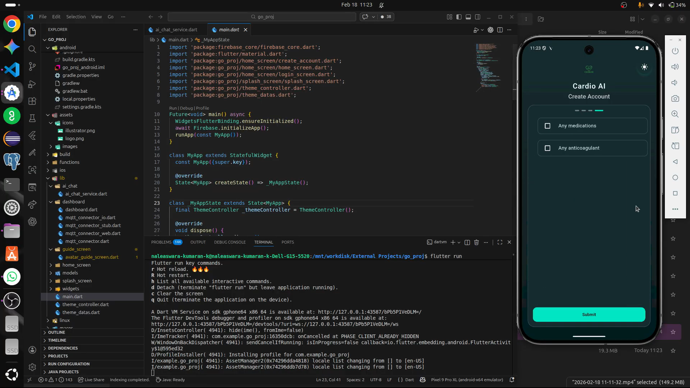

# Cardio_AI ECG Analyser

Flutter + Firebase health monitoring app with:

- Firebase authentication and user profile storage
- Real-time ECG/vitals ingestion over MQTT
- Dashboard checkup flow with simple ECG status detection
- AI avatar guide chat via Firebase Cloud Functions (Python)
- Speech-to-text input and text-to-speech response support

## Demo Video
[](https://drive.google.com/file/d/1RtoL6sSn7s6nEECeUkrOGCi7NekxjB71/view?usp=sharing)

## Tech stack

- Flutter (Dart SDK `^3.10.7`)
- Firebase: `firebase_core`, `firebase_auth`, `cloud_firestore`, `cloud_functions`
- MQTT: `mqtt_client`
- Voice: `speech_to_text`, `flutter_tts`
- Charts: `fl_chart`
- Cloud Functions (Python) for AI chat routing

## Project structure

```
lib/
	main.dart                      # App entry + Firebase init + routes
	home_screen/                   # Login/home/account creation
	dashboard/dashboard.dart       # MQTT, vitals, checkup flow
	guide_screen/avatar_guide_screen.dart  # AI avatar chat and TTS UI
	ai_chat/ai_chat_service.dart   # Callable function client (aiAvatarChat)
	models/                        # App models
	widgets/                       # Shared UI widgets

functions/
	main.py                        # Firebase Python function(s)
	requirements.txt               # Python dependencies

assets/
	icons/
	images/initialmotion/
	images/lipmotion/
```

## App flow

1. App initializes Firebase in `lib/main.dart`.
2. User signs in / creates account.
3. Dashboard connects to MQTT broker and subscribes to ECG topic.
4. Checkup window evaluates incoming samples.
5. User opens avatar guide, where app can call `aiAvatarChat` Cloud Function.

## Prerequisites

- Flutter SDK installed and available in PATH
- Dart SDK compatible with `^3.10.7`
- Firebase project configured
- Android Studio / Xcode (for mobile targets)
- Python 3.10+ (for functions)
- Firebase CLI (`npm i -g firebase-tools`)

## Local setup

### 1) Install Flutter dependencies

```bash
flutter pub get
```

### 2) Configure Firebase for Flutter app

If not already configured, run:

```bash
flutterfire configure
```

Then ensure platform config files are present for your targets.

### 3) Run app

```bash
flutter run
```

For web:

```bash
flutter run -d chrome
```

## MQTT configuration

Dashboard MQTT constants are currently defined in `lib/dashboard/dashboard.dart` (host, port, topic, credentials, TLS, websocket path).

Current topic used by app:

- `ecg/data`

Recommended for production:

- Move broker credentials to secure backend/config service
- Do not hardcode secrets in client-side code

## AI Cloud Function setup (Python)

From `functions/`:

```bash
python3 -m venv .venv
source .venv/bin/activate
pip install -r requirements.txt
```

Set Groq API key in Firebase Secret Manager:

```bash
firebase functions:secrets:set GROQ_API_KEY --project YOUR_PROJECT_ID
```

Deploy functions:

```bash
firebase deploy --only functions --project YOUR_PROJECT_ID
```

The Flutter app calls function:

- Name: `aiAvatarChat`
- Region: `us-central1`

If you change region, update `lib/ai_chat/ai_chat_service.dart`.

## Authentication and data

- AI callable function requires authenticated users.
- User profile and health/session data are stored in Cloud Firestore.

## Build commands

```bash
# Android APK
flutter build apk --release

# Android App Bundle
flutter build appbundle --release

# iOS (macOS only)
flutter build ios --release

# Web
flutter build web --release
```

## Development notes

- Theme mode is managed by `lib/theme_controller.dart` and `lib/theme_datas.dart`.
- Text scaling is clamped in `lib/main.dart` for UI consistency.
- Avatar motion frames are loaded from assets in `assets/images/initialmotion/` and `assets/images/lipmotion/`.

## Troubleshooting

- Firebase init error on startup:
	- Verify platform Firebase config files and rerun `flutterfire configure`.
- Cloud Function timeout/error:
	- Check function region and `GROQ_API_KEY` secret.
- No ECG updates:
	- Verify broker reachability, topic, credentials, TLS/websocket settings, and incoming payload format.

## License

Add your project license here (for example, MIT) if this repository is shared publicly.
